# Martian Token Crowdsale

## Create the KaseiCoin Token Contract

The KaseiCoin token contract is implemented in the solidity file [KaseiCoin.sol](KaseiCoin.sol). 

We are able to compile KaseiCoin.sol:
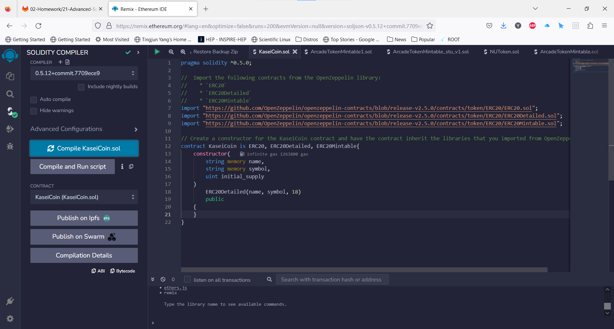

## Create the KaseiCoin Crowdsale Contract and KaseiCoin Deployer Contract

The KaseiCoin Crowdsale contract and KaseiCoin Deployer contract are implemented in the solidity file [KaseiCoinCrowdsale.sol](KaseiCoinCrowdsale.sol).

We are able to compile KaseiCoinCrowdsale.sol:
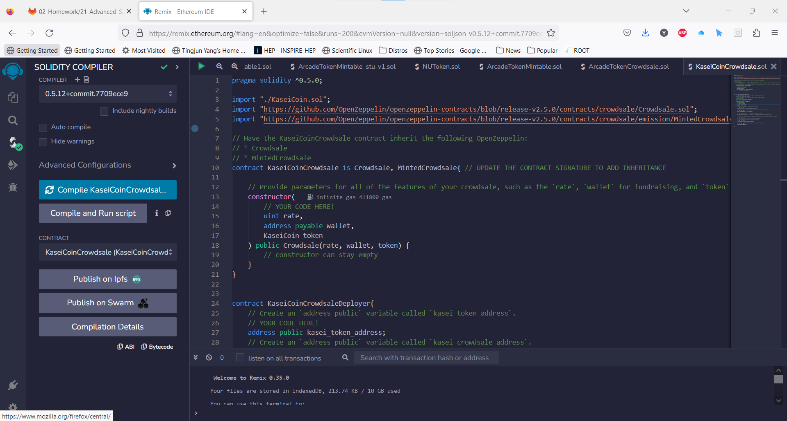

## Deploy and Test the Crowdsale on a Local Blockchain

In Remix, we employ `Injected Provider - MetaMask` environment which connects to Ganache through MetaMask. 
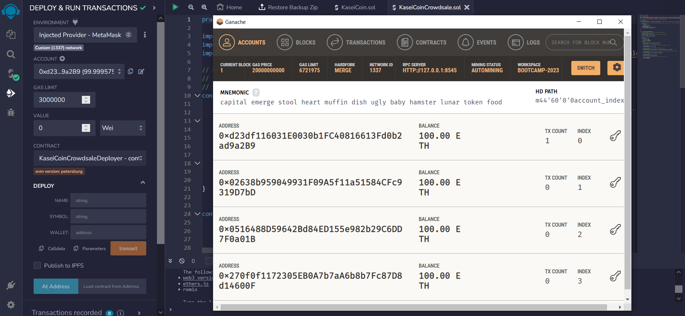

We first deploy the KaseiCoinCrowdsaleDeployer contract:
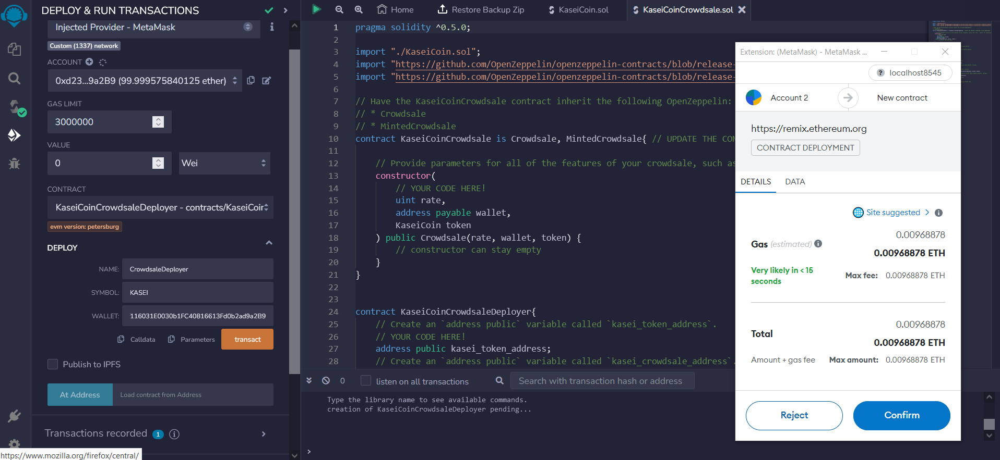

We then deploy the KaseiCoin contract at address `0x7479B7F6685177cA7ec34765Bf0110DBb050A2D0`:

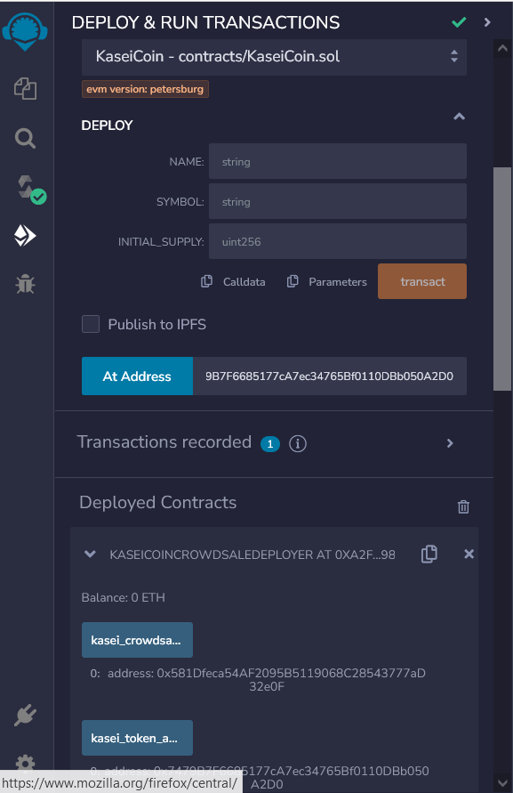 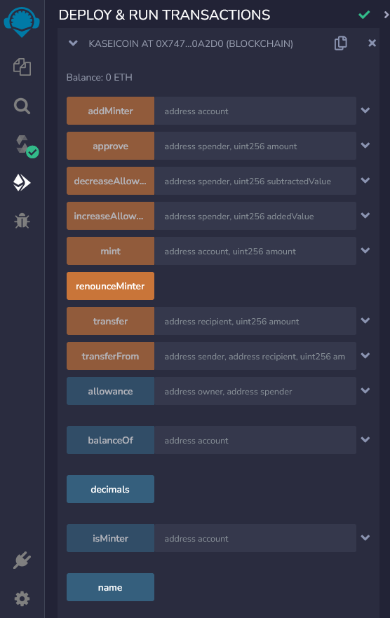

Finally we deploy the KaseiCoinCrowdsale contract at address `0x581Dfeca54AF2095B5119068C28543777aD32e0F`:

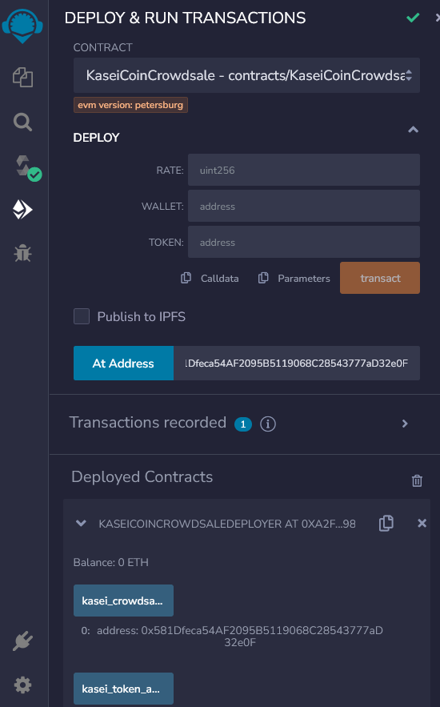 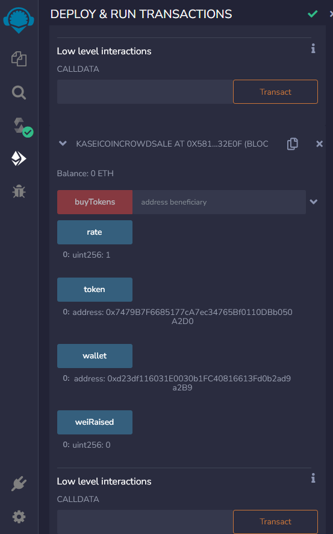

To test the functionality of the crowdsale, we bought 1000 Wei:

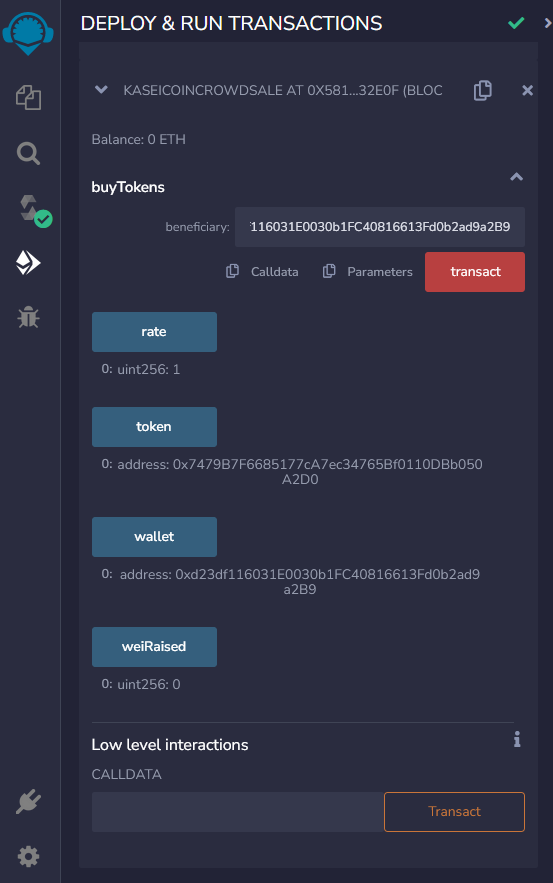 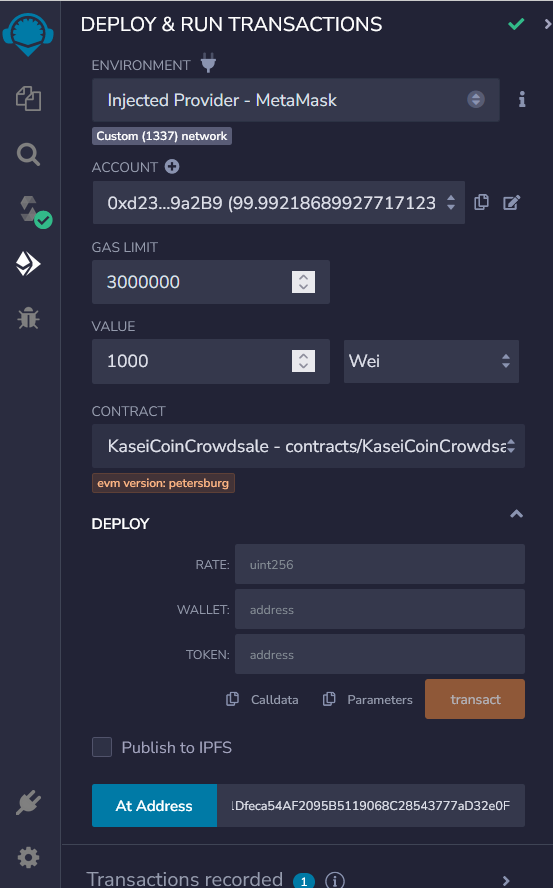 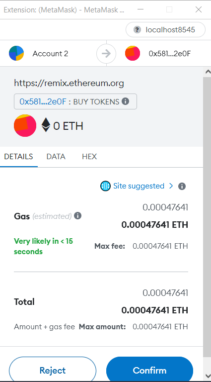

The transaction was successful:

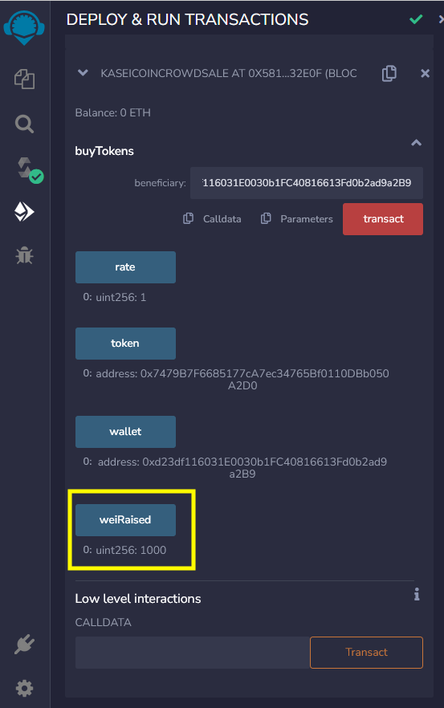

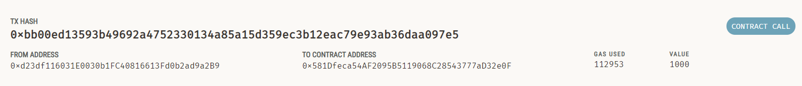

